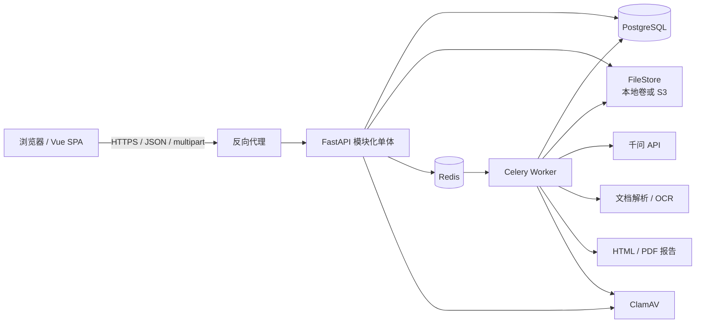
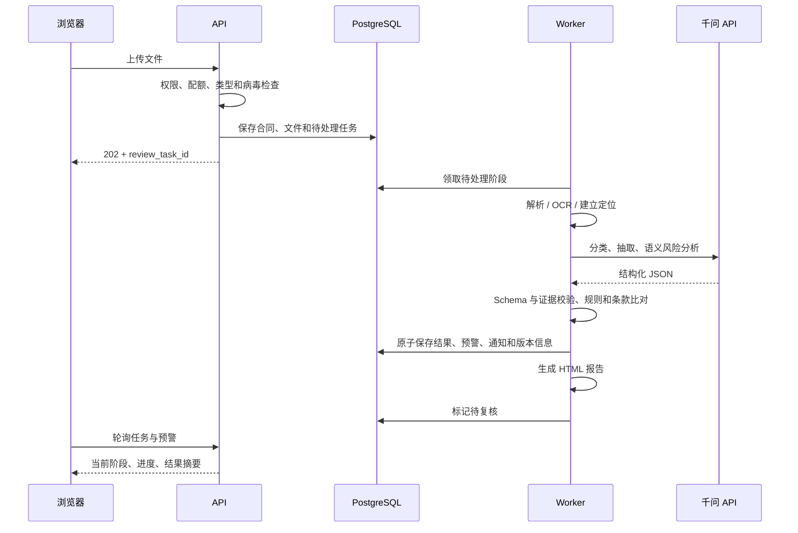
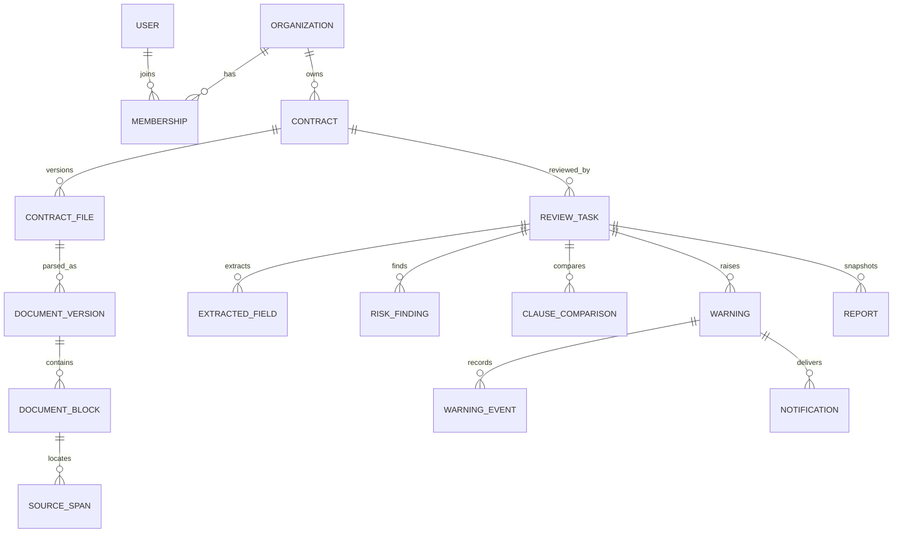

# 企业合同智能审核与风险预警系统架构设计

## 1. 文档定位

本文基于 `docs/requirements.md` 与 `docs/2026省赛赛题手册.pdf`，给出第一阶段可运行产品及后续企业化能力的系统设计。本文只定义技术方案和边界，不包含业务代码。

### 1.1 设计目标

- 打通合同上传、解析/OCR、分类、要素抽取、风险审核、条款比对、预警、人工复核和报告导出的完整链路。
- 所有模型结论都能回到原文证据，并能追踪模型、提示词、规则和模板版本。
- 以后端为权限和数据一致性的唯一可信边界，实现组织级数据隔离。
- 长耗时处理可异步执行、分阶段重试，并且不因单个外部服务失败丢失已完成结果。
- 首期可在单机 Docker Compose 中运行，后续不改业务模型即可迁移文件存储和横向扩容 Worker。

### 1.2 明确不做

- 第一阶段不做微服务拆分、Kubernetes、事件总线、知识图谱和模型微调平台。
- 不自动签署或改写原合同，不把模型结果表述为最终法律意见。
- 不实现邮件、企业微信、SSO 和合同履约提醒，只保留稳定的接入边界。
- 不为开发环境另设 MySQL。开发、测试和生产统一使用 PostgreSQL，避免 JSON、索引、约束和事务行为不一致。

## 2. 架构决策摘要

| 主题 | 决策 | 理由 |
| --- | --- | --- |
| 系统形态 | 模块化单体 API + 独立异步 Worker | 业务事务关联紧密，团队规模和首期流量不支持微服务成本；Worker 隔离 OCR、模型和报告等耗时工作 |
| 前端 | Vue 3 + TypeScript + Vite + Element Plus | 符合赛题推荐栈，适合桌面端管理和审核界面 |
| 后端 | Python 3.12 + FastAPI + Pydantic 2 + SQLAlchemy 2 + Alembic | 文档/OCR/LLM 生态完整，OpenAPI 和结构化校验成熟 |
| 主数据库 | PostgreSQL 16+ | 事务、约束、JSONB、部分唯一索引和全文检索能力满足当前需求 |
| 异步任务 | Celery + Redis | 支持阶段任务、重试、超时和横向扩容；数据库仍保存业务状态，Redis 不作为事实来源 |
| 文件存储 | 首期本地持久卷，统一 `FileStore` 边界；生产可切 S3 兼容对象存储 | 单机演示简单，同时保留迁移能力 |
| 身份认证 | 服务端不透明会话 Cookie + Argon2id 密码哈希 + CSRF 防护 | 浏览器系统无需 JWT；便于注销、停用用户和权限变更立即生效 |
| 状态更新 | HTTP 轮询，前台任务页 2 秒轮询并退避 | 满足 5 秒感知要求，首期不引入 WebSocket 连接状态复杂度 |
| 模型 | 千问商用 API，经 `ModelGateway` 适配层调用 | 满足当前产品决策，隔离供应商协议、重试和结构化输出校验 |
| 报告 | Jinja2 生成固定版本 HTML，Chromium 打印 PDF | 在线与 PDF 使用同一份报告数据和模板，降低内容不一致风险 |

## 3. 总体架构



逻辑上只有三个可部署的应用进程：Web 前端、API、Worker。API 和 Worker 复用同一个 Python 代码库与领域服务，区别仅在入口和进程职责。

### 3.1 后端模块

| 模块 | 职责 | 不负责 |
| --- | --- | --- |
| `identity` | 登录、会话、密码重置、用户与组织成员关系、RBAC | 合同业务授权 |
| `contracts` | 合同元数据、文件上传、访问范围、归档 | 文档解析实现 |
| `documents` | 文件校验、文本提取、OCR、页面/段落/坐标定位 | 风险判断 |
| `reviews` | 审核任务状态机、阶段编排、重试、结果聚合 | 供应商 API 细节 |
| `extraction` | 合同分类和结构化要素结果 | 文件读取和预警处置 |
| `risks` | 风险规则版本、规则执行、风险发现和人工修订 | 通知投递 |
| `clauses` | 标准条款模板版本和比对结果 | 直接修改历史模板版本 |
| `warnings` | 预警生成、去重、分派、状态事件和站内通知 | 审核报告排版 |
| `reports` | 报告快照、HTML/PDF 生成和下载 | 重算审核结果 |
| `feedback` | 正确/错误/修改/忽略标注及统计 | 自动训练生产模型 |
| `audit` | 关键操作审计、查询与导出 | 调试日志 |
| `integrations` | 千问、OCR、文件存储、病毒扫描、通知适配 | 领域状态决策 |

模块间通过应用服务调用，不跨模块直接操作对方的数据表。首期不建立内部消息总线；需要可靠异步执行的动作以数据库状态为事实来源，由 Celery 消费和定时补偿。

## 4. 前后端边界

### 4.1 前端职责

- 展示登录、合同、任务、审核结果、预警、模板/规则、用户和审计页面。
- 处理表单状态、文件选择、上传进度、筛选条件和页面级缓存。
- 对任务和未读通知进行轮询；页面不可见时降低频率，任务进入终态后停止轮询。
- 根据后端返回的权限集合控制入口和按钮，但不把前端控制视为安全措施。
- 展示后端给出的可读错误、字段错误和任务失败原因，不解析服务端日志或堆栈。
- 原文定位按统一 `source_locator` 展示：PDF/图片跳页并高亮坐标，DOCX 跳转段落或表格单元格并高亮字符区间。

### 4.2 后端职责

- 完成身份认证、CSRF、RBAC、组织归属和合同访问范围检查。
- 校验扩展名、MIME、文件签名、大小和组织配额，生成不可预测的存储键。
- 管理审核状态机、幂等、并发限制、重试、版本锁定和事务一致性。
- 执行全部规则、模型调用、输出 Schema 校验、证据校验和预警去重。
- 生成报告快照和下载授权；不信任前端传回的组织 ID、角色、风险等级或报告内容。

### 4.3 接口契约

- API 前缀为 `/api/v1`，JSON 字段统一使用 `snake_case`。
- 时间使用 ISO 8601 UTC，例如 `2026-08-17T03:30:00Z`；前端转换为用户时区。
- 业务主键使用 UUID；对外展示另设可读编号，例如 `CTR-20260817-000123`、`RPT-...`。
- 金额以字符串十进制数和 ISO 4217 币种传输，禁止使用浮点数。
- 列表使用游标分页：`?limit=50&cursor=...`，默认 20，最大 100。
- OpenAPI 是前后端契约来源。前端使用生成的 TypeScript 类型和一个薄 `fetch` 封装，不手工维护重复 DTO。
- 新增字段保持向后兼容；删除或改变含义必须发布新的 API 主版本。

## 5. 核心处理流程

### 5.1 审核流水线



每个阶段都写入 `review_stage_runs`。重试从第一个失败或未完成阶段继续，不重复提交已经成功且输入指纹未变化的模型调用。审核任务锁定文档版本、规则集版本、条款模板版本、提示词版本和模型配置快照。

### 5.2 任务状态机

| 状态 | 进入条件 | 可执行动作 |
| --- | --- | --- |
| `pending` | 上传和校验完成 | 取消、开始处理 |
| `parsing` | Worker 领取解析阶段 | 记录进度、失败 |
| `reviewing` | 文档可用且开始规则/模型审核 | 记录进度、失败 |
| `pending_review` | 机器审核和预警生成完成 | 人工修订、确认完成 |
| `completed` | 审核员确认或按组织配置自动完成 | 导出、归档、重新审核 |
| `failed` | 某阶段达到重试上限或产生不可重试错误 | 查看原因、从失败阶段重试 |
| `archived` | 人工归档 | 只读查看、按权限恢复 |

状态迁移由后端命令完成，并以条件更新防止两个 Worker 同时推进。`failed` 保存公开错误码和可读信息；内部异常只进入受控日志。

### 5.3 预警状态机

允许的主流程为：`pending_confirmation -> in_progress -> resolved -> closed`。`pending_confirmation` 或 `in_progress` 可进入 `ignored`；组织管理员可将 `ignored` 或 `closed` 重新打开到 `in_progress`。转派不改变主状态，但必须新增事件。

每次确认、误报、忽略、转派、说明、解决、关闭和重新打开都追加 `warning_events`，不得覆盖历史事件。关闭必须包含结论或关联的人工修订记录。

## 6. 数据库模型

### 6.1 通用约定

- 所有组织业务表包含 `organization_id`、`created_at`、`updated_at`；可删除资源增加 `deleted_at`，历史事实表只追加不软删。
- 同一组织内使用 `(organization_id, id)` 唯一约束，并为跨表关系建立包含 `organization_id` 的复合外键，阻止跨组织错误关联。
- 所有时间由数据库或服务端写入 UTC。金额使用 `numeric(20, 4)`，置信度使用 `numeric(5, 4)` 并限制在 0 到 1。
- 枚举在数据库使用受约束的短字符串，便于迁移；高频过滤列使用普通 B-tree 索引。
- JSONB 只用于结构可变的模型值、定位信息和请求快照；权限、状态、版本和关联关系必须是关系列。
- 版本表一经发布即不可更新。修改操作复制草稿并发布新版本，历史审核只引用原版本。
- 审计、人工修订、预警事件和模型调用记录为追加写，应用不提供物理删除接口。

### 6.2 身份与租户

| 表 | 关键字段 | 关键约束/说明 |
| --- | --- | --- |
| `organizations` | `id`, `name`, `status`, `settings_json`, `retention_days` | 组织隔离根实体；限额配置经 Pydantic Schema 校验 |
| `users` | `id`, `email`, `display_name`, `password_hash`, `status`, `is_platform_admin` | `email` 规范化后全局唯一；平台管理员不由组织角色隐式产生 |
| `organization_memberships` | `organization_id`, `user_id`, `role`, `status` | `(organization_id, user_id)` 唯一；角色为 `org_admin/reviewer/viewer` |
| `contract_access_grants` | `organization_id`, `contract_id`, `user_id`, `access_level` | 业务查看者仅可见显式授权合同；管理员和审核员按角色策略访问 |
| `auth_sessions` | `id`, `user_id`, `token_hash`, `csrf_hash`, `idle_expires_at`, `absolute_expires_at`, `revoked_at` | 只保存随机令牌哈希；停用用户时批量撤销 |
| `auth_one_time_tokens` | `user_id`, `purpose`, `token_hash`, `expires_at`, `used_at` | 用于邀请和密码重置；一次性消费 |

### 6.3 合同、文件与文档结构

| 表 | 关键字段 | 关键约束/说明 |
| --- | --- | --- |
| `contracts` | `organization_id`, `display_no`, `title`, `declared_type`, `status`, `owner_id`, `archived_at` | 展示编号在组织内唯一；不存原始文件路径 |
| `file_objects` | `organization_id`, `storage_key`, `original_name`, `media_type`, `size_bytes`, `sha256`, `scan_status`, `storage_status` | `storage_key` 全局唯一；保存校验和，不保存正文 |
| `contract_files` | `organization_id`, `contract_id`, `file_object_id`, `version_no`, `is_current` | 一个合同可有多个原文件版本；审核任务引用确定版本 |
| `document_versions` | `organization_id`, `contract_file_id`, `parser_name`, `parser_version`, `text_sha256`, `ocr_status`, `page_count`, `status` | 输入文件和解析配置相同可复用成功结果 |
| `document_pages` | `organization_id`, `document_version_id`, `page_no`, `width`, `height`, `text`, `image_file_id`, `ocr_confidence` | PDF/图片按页保存；DOCX 的逻辑页可为空 |
| `document_blocks` | `organization_id`, `document_version_id`, `page_id`, `order_no`, `block_type`, `paragraph_no`, `table_path`, `text`, `bbox_json` | 保留标题、段落、表格和原始顺序 |
| `source_spans` | `organization_id`, `document_version_id`, `page_id`, `block_id`, `start_offset`, `end_offset`, `bbox_json`, `quote`, `quote_sha256` | 抽取、风险和比对结果引用的统一证据定位；至少有 block 或 page |

DOCX 不保证与办公软件分页完全一致，因此其权威定位是段落号、表格路径和字符区间；PDF/图片使用页码、坐标和字符区间。界面必须如实展示定位类型，不能伪造 DOCX 页码。

### 6.4 审核、模型与结果

| 表 | 关键字段 | 关键约束/说明 |
| --- | --- | --- |
| `review_tasks` | `organization_id`, `contract_id`, `contract_file_id`, `document_version_id`, `status`, `progress`, `rule_bundle_version_id`, `clause_template_version_id`, `prompt_bundle_version`, `model_config_json`, `error_code`, `error_message`, `started_at`, `finished_at` | 创建时锁定所有输入版本；`progress` 仅用于展示，状态为事实 |
| `review_stage_runs` | `organization_id`, `review_task_id`, `stage`, `attempt_no`, `status`, `input_fingerprint`, `lease_owner`, `lease_expires_at`, `heartbeat_at`, `started_at`, `finished_at`, `error_class` | `(review_task_id, stage, attempt_no)` 唯一；租约用于回收崩溃 Worker 的任务 |
| `model_configurations` | `organization_id`, `provider`, `model`, `timeout_seconds`, `max_retries`, `budget_json`, `secret_ref`, `status` | 可为平台默认或组织覆盖；`secret_ref` 只指向部署密钥名称，不保存密钥值 |
| `prompt_bundle_versions` | `organization_id`, `version_no`, `status`, `classification_prompt`, `extraction_prompt`, `risk_prompt`, `comparison_prompt`, `schema_versions_json`, `change_note`, `published_by` | 发布后不可变；系统基线在创建组织时复制为组织版本 |
| `model_calls` | `organization_id`, `review_task_id`, `stage_run_id`, `provider`, `model`, `prompt_version`, `request_fingerprint`, `provider_request_id`, `status`, `token_input`, `token_output`, `latency_ms`, `error_code`, `response_schema_version` | 不默认保存完整正文；必要快照加密且受保留策略控制 |
| `contract_classifications` | `organization_id`, `review_task_id`, `model_value`, `current_value`, `confidence`, `status`, `evidence_span_id`, `edited_by` | 原始模型值和人工当前值并存；每任务一条当前分类 |
| `extracted_fields` | `organization_id`, `review_task_id`, `field_key`, `model_value_json`, `current_value_json`, `raw_text`, `confidence`, `status`, `evidence_span_id`, `edited_by` | `(review_task_id, field_key)` 唯一；缺失值为 JSON `null` 并保存状态 |
| `result_revisions` | `organization_id`, `subject_type`, `subject_id`, `before_json`, `after_json`, `reason`, `actor_id`, `created_at` | 记录分类、字段、风险和比对结果的人工修改；追加写 |

分类、字段、风险和条款比对分别使用各自的 `*_evidence` 关联表连接一个或多个 `source_spans`，并记录顺序和主证据标记。结果表中的 `evidence_span_id` 是列表页使用的主证据快捷引用，不能代替完整证据关联。`subject_type/subject_id` 只用于不可变修订日志，不承担业务外键导航；写入时由服务层校验目标实体和组织，审计任务定期检查悬空引用。

### 6.5 规则、风险与标准条款

| 表 | 关键字段 | 关键约束/说明 |
| --- | --- | --- |
| `risk_rule_bundles` | `organization_id`, `name`, `current_published_version_id` | 风险规则集逻辑身份 |
| `risk_rule_bundle_versions` | `organization_id`, `bundle_id`, `version_no`, `status`, `change_note`, `effective_at`, `published_by` | `(bundle_id, version_no)` 唯一；发布后不可变 |
| `risk_rules` | `organization_id`, `bundle_version_id`, `rule_key`, `risk_type`, `engine`, `condition_json`, `severity`, `suggestion`, `enabled` | `engine` 首期仅 `deterministic/model`；条件使用白名单 Schema，不执行任意代码 |
| `risk_findings` | `organization_id`, `review_task_id`, `risk_type`, `severity`, `title`, `description`, `basis`, `suggestion`, `confidence`, `source`, `status`, `source_span_id`, `rule_id`, `model_call_id`, `fingerprint` | `(review_task_id, fingerprint)` 唯一；无证据不得进入 `confirmed` |
| `clause_templates` | `organization_id`, `name`, `contract_type`, `business_scenario`, `current_published_version_id` | 模板逻辑身份；可复制、停用 |
| `clause_template_versions` | `organization_id`, `template_id`, `version_no`, `status`, `change_note`, `effective_at`, `published_by` | 发布后不可变；审核任务直接引用版本 |
| `standard_clauses` | `organization_id`, `template_version_id`, `clause_key`, `name`, `standard_text`, `allowed_deviation`, `severity`, `applicability_json`, `suggestion`, `order_no` | 归属于不可变模板版本 |
| `clause_comparisons` | `organization_id`, `review_task_id`, `standard_clause_id`, `status`, `contract_text`, `difference_summary`, `severity`, `suggestion`, `source_span_id`, `confidence`, `model_call_id` | 状态为 `matched/deviated/missing/uncertain`；缺失可无定位，其余应有证据 |

### 6.6 预警、通知、报告和审计

| 表 | 关键字段 | 关键约束/说明 |
| --- | --- | --- |
| `warnings` | `organization_id`, `review_task_id`, `contract_id`, `risk_finding_id`, `clause_comparison_id`, `extracted_field_id`, `classification_id`, `trigger_type`, `dedupe_key`, `priority`, `status`, `assignee_id`, `due_at`, `resolution`, `closed_at` | 风险、条款、字段或分类至少关联一个；活动状态下 `dedupe_key` 部分唯一 |
| `warning_events` | `organization_id`, `warning_id`, `event_type`, `from_status`, `to_status`, `actor_id`, `note`, `metadata_json`, `created_at` | 追加写时间线；首个事件保存触发条件和规则版本 |
| `notifications` | `organization_id`, `user_id`, `warning_id`, `channel`, `status`, `attempts`, `next_attempt_at`, `read_at`, `error_code` | 站内通知首期必做；外部投递失败不回滚预警 |
| `reports` | `organization_id`, `review_task_id`, `display_no`, `format`, `status`, `snapshot_json`, `template_version`, `file_object_id`, `generated_at`, `error_code` | 报告使用不可变快照；重新生成创建新记录，不覆盖旧文件 |
| `feedback` | `organization_id`, `review_task_id`, `subject_type`, `subject_id`, `label`, `original_json`, `corrected_json`, `note`, `created_by` | 标签为 `correct/incorrect/modified/ignored`；不自动用于线上训练 |
| `idempotency_records` | `organization_id`, `route_key`, `idempotency_key`, `request_hash`, `response_status`, `resource_type`, `resource_id`, `expires_at` | `(organization_id, route_key, idempotency_key)` 唯一；相同键不同请求摘要返回冲突 |
| `audit_logs` | `organization_id`, `actor_id`, `action`, `resource_type`, `resource_id`, `request_id`, `ip`, `user_agent`, `before_summary_json`, `after_summary_json`, `created_at` | 追加写；正文、密码、令牌、密钥不得写入 |

### 6.7 主要关系



## 7. 认证与授权

### 7.1 登录和会话

1. 用户提交邮箱和密码，后端按统一格式规范化邮箱并使用 Argon2id 校验密码。
2. 成功后生成至少 256 bit 随机会话令牌，只把 SHA-256 哈希写入 `auth_sessions`。
3. 原始令牌写入 `Secure; HttpOnly; SameSite=Lax` Cookie；生产必须启用 HTTPS。
4. 登录响应或安全的 `GET /auth/session` 返回本次会话的 CSRF 原始值，服务端只保存哈希；前端在内存中保存，并在非安全 HTTP 方法的 Header 中提交。页面刷新后重新获取并轮换该值。
5. 非安全 HTTP 方法同时校验 Origin 和 CSRF Header。登录、重置密码和高频失败请求按 IP 与账号限流。
6. 会话默认闲置 8 小时、绝对有效期 7 天；密码重置、用户停用和关键权限变化撤销相关会话。

前端与 API 采用同域部署，不开放任意 CORS Origin。未来接入企业 SSO 时新增 OIDC 登录入口，SSO 最终仍换取同一种本地会话，业务层无需识别身份提供方。

### 7.2 授权策略

每个请求依次执行：

1. 会话有效且用户状态正常。
2. 用户是平台管理员，或存在目标组织的有效成员关系。
3. 角色具有该动作权限。
4. 目标资源 `organization_id` 与当前租户一致。
5. 业务查看者还必须具有相应 `contract_access_grants`。

平台管理员只通过单独的平台管理路由访问跨组织信息，不给普通业务路由添加隐式“查看全部”分支。后台任务携带 `organization_id` 和 `review_task_id`，加载任务后重新建立租户上下文，不能信任消息参数中的资源归属。

### 7.3 角色权限基线

| 能力 | 平台管理员 | 组织管理员 | 审核员 | 业务查看者 |
| --- | --- | --- | --- | --- |
| 平台与组织管理 | 是 | 否 | 否 | 否 |
| 本组织用户、规则、模板 | 只通过平台路由 | 是 | 只读已发布版本 | 否 |
| 上传和创建审核 | 否 | 是 | 是 | 否 |
| 修改审核结果、处置预警 | 否 | 是 | 是 | 否 |
| 查看合同和报告 | 按支持流程临时授权 | 本组织全部 | 本组织业务范围 | 仅显式授权 |
| 查看审计日志 | 全局 | 本组织 | 否 | 否 |

## 8. API 设计

### 8.1 核心资源接口

| 资源 | 主要接口 | 说明 |
| --- | --- | --- |
| 认证 | `POST /auth/login`, `POST /auth/logout`, `GET /auth/session`, `POST /auth/password-reset/*` | 登录响应不返回密码信息或会话令牌 JSON |
| 组织成员 | `GET/POST /organizations/{id}/members`, `PATCH /members/{id}` | 组织管理员不能授予平台管理员 |
| 合同 | `POST /contracts`, `GET /contracts`, `GET/PATCH /contracts/{id}`, `POST /contracts/{id}/archive` | 删除和归档使用明确动作，避免含混的物理 DELETE |
| 文件 | `POST /contracts/{id}/files`, `GET /files/{id}/download`, `GET /documents/{id}/pages/{page_no}` | 上传使用 multipart；下载每次重新授权 |
| 审核任务 | `POST /contracts/{id}/reviews`, `GET /review-tasks/{id}`, `POST /review-tasks/{id}/retry`, `POST /review-tasks/{id}/complete` | 创建成功返回 `202 Accepted` 与任务 ID |
| 审核结果 | `GET /review-tasks/{id}/results`, `PATCH /extracted-fields/{id}`, `PATCH /risk-findings/{id}`, `PATCH /clause-comparisons/{id}` | PATCH 必须携带当前 `version`，冲突返回 409 |
| 风险规则 | `GET/POST /risk-rule-bundles`, `POST /risk-rule-bundles/{id}/versions`, `POST /risk-rule-bundle-versions/{id}/publish` | 发布版本不可编辑 |
| 条款模板 | `GET/POST /clause-templates`, `POST /clause-templates/{id}/versions`, `POST /clause-template-versions/{id}/publish` | 创建审核时选择已发布版本 |
| 预警 | `GET /warnings`, `GET /warnings/{id}`, `POST /warnings/{id}/events` | 事件命令包含 `type`、说明和可选责任人/截止时间 |
| 通知 | `GET /notifications`, `POST /notifications/{id}/read`, `GET /notifications/unread-count` | 首期仅站内通知 |
| 报告 | `POST /review-tasks/{id}/reports`, `GET /reports/{id}`, `GET /reports/{id}/download` | 生成接口返回 202；下载采用短时授权响应或流式返回 |
| 反馈 | `POST /feedback`, `GET /feedback/summary` | 统计按组织、合同类型和版本聚合 |
| 审计 | `GET /audit-logs` | 仅平台或组织管理员，禁止修改 |

### 8.2 幂等与并发

- 创建合同、上传完成、创建审核和创建报告支持 `Idempotency-Key`。数据库保存组织、路由、键、请求摘要和响应引用，默认保留 24 小时。
- 文件以 SHA-256 标识内容；同一任务、同一文件版本和同一解析配置只产生一个成功的 `document_version`。
- 规则和模型结果使用稳定输入指纹。重试若输入与版本未改变，复用成功阶段；人工选择“重新审核”则创建新的 `review_task`。
- 人工编辑资源包含递增 `version`，使用 `If-Match` 或请求体版本进行乐观锁。版本不一致返回 `409 RESOURCE_VERSION_CONFLICT`。
- 活动预警使用数据库部分唯一索引去重，不能只靠 Worker 先查后写。

## 9. 错误处理与恢复

### 9.1 HTTP 错误格式

```json
{
  "error": {
    "code": "CONTRACT_FILE_UNSUPPORTED",
    "message": "仅支持 DOCX、PDF、PNG 和 JPEG 文件。",
    "request_id": "req_01...",
    "details": {
      "field": "file"
    }
  }
}
```

- `code` 是稳定的机器可读标识；`message` 是可展示中文，不包含内部堆栈。
- `details` 只放字段错误、限额和可恢复提示等安全信息；生产响应不返回 SQL、路径、模型原始错误或密钥。
- 未预期异常统一返回 `500 INTERNAL_ERROR`，日志通过 `request_id` 关联。

### 9.2 状态码约定

| HTTP 状态 | 用途 |
| --- | --- |
| `400` | 格式正确但业务参数不成立 |
| `401` | 未登录、会话过期或已撤销 |
| `403` | 已登录但角色或资源范围不允许 |
| `404` | 资源不存在，或为防止枚举而隐藏无权资源 |
| `409` | 状态迁移非法、幂等键冲突、版本冲突 |
| `413` | 文件超过组织配置上限 |
| `415` | 扩展名、MIME 或文件签名不受支持 |
| `422` | 请求字段或模型结构化结果未通过 Schema 校验 |
| `429` | 用户/组织并发或外部模型预算达到上限 |
| `502/503/504` | 同步依赖异常；异步依赖错误通常记录到任务而非直接返回 |

### 9.3 异步错误分类

| 类别 | 示例 | 策略 |
| --- | --- | --- |
| 可重试瞬时错误 | 千问 429/5xx、连接超时、临时存储错误 | 指数退避加抖动，遵守 `Retry-After`，达到配置上限后失败 |
| 可局部降级 | 单页 OCR 低置信度、通知发送失败、PDF 报告失败 | 保留其他结果，标记页面/通知/报告状态并允许单独重试 |
| 不可重试输入错误 | 文件损坏、加密 PDF、页数超限、完全无可识别内容 | 立即失败并给出安全、可读原因 |
| 模型输出错误 | 非法 JSON、Schema 不符、证据无法定位 | 同一调用最多做一次修复重试；仍失败则进入人工复核或该阶段失败 |
| 配置错误 | 无可用模型密钥、未发布模板 | 不消耗重试次数，提示管理员修复后重试 |

阶段提交采用数据库事务。只有一个阶段的全部业务结果和状态都写成功后才标记成功。Worker 崩溃留下的 `running` 阶段由定时补偿任务按租约超时回收到 `retryable`。Redis 消息丢失时，补偿任务扫描数据库中的待处理任务并重新投递。

## 10. 文档、模型与报告实现边界

### 10.1 文档解析栈

- DOCX：`python-docx` 读取段落、标题、表格和顺序；宏文档与旧版 `.doc` 首期拒绝。
- 文本 PDF：`pypdf` 提取文本，保留页码；需要页面预览时用 `pypdfium2` 栅格化。
- 扫描 PDF/图片：`PaddleOCR` 中文 CPU 模型；逐页保存置信度和坐标。低于组织阈值的页面进入人工提示。
- 文件识别：扩展名、声明 MIME、文件签名三者联合判断；ClamAV 扫描通过前文件停留在隔离区。

解析器输出统一的 `DocumentVersion -> Page -> Block -> SourceSpan` 模型。原始抽取文本保存在数据库，页面图片和原文件进入文件存储。单页 OCR 失败不能静默生成空页。

### 10.2 千问适配层

`ModelGateway` 暴露四个明确方法：合同分类、结构化要素抽取、风险语义分析、条款比对/建议生成。业务服务传入版本化请求对象，不直接引用千问 SDK 类型。

适配层统一处理：

- 服务端密钥注入、模型名、超时、并发和调用预算。
- JSON Schema 约束、Pydantic 二次校验和未知字段拒绝。
- 可重试错误映射、请求指纹、供应商请求 ID、token 和耗时统计。
- 提示词版本、Schema 版本、模型版本和脱敏策略记录。
- 日志正文截断和敏感字段遮蔽；默认不记录提示词中的合同全文。

规则引擎只支持预定义操作符，例如关键词、正则、金额/日期阈值、字段存在性和逻辑组合。管理员配置经过 Schema 校验，禁止执行 Python、SQL 或任意表达式代码。

### 10.3 报告

- 报告生成前创建 `snapshot_json`，包含当时的合同元数据、风险、字段、条款比对、人工修订、版本和免责声明。
- HTML 由版本化 Jinja2 模板渲染；PDF 由同一 HTML 通过固定版本 Chromium 打印。
- 重新生成报告创建新版本，不修改历史报告；报告文件和原合同使用相同授权与保留策略。
- HTML 中的所有用户文本默认转义，禁止模型输出直接作为可信 HTML。

## 11. 文件存储

### 11.1 存储生命周期

1. API 流式接收文件到隔离区，同时计算 SHA-256 和大小，禁止一次性读入内存。
2. 校验扩展名、MIME、文件签名、组织配额和病毒扫描。
3. 通过后移动到正式随机键，例如 `org/{organization_uuid}/contracts/{contract_uuid}/{file_uuid}`；原文件名只作为数据库元数据。
4. 解析和报告仅通过 `FileStore` 读取/写入，业务表不拼接本地绝对路径。
5. 软删除进入待清理状态；定时清理任务在保留期和引用检查通过后物理删除，并写审计日志。

`FileStore` 首期只需要 `put/open/delete/exists` 和可选的短时下载能力。本地实现使用 Docker 命名卷；迁移到 S3 兼容对象存储时启用服务端加密和生命周期策略。数据库备份与文件快照必须属于同一个恢复点说明，避免只恢复元数据。

### 11.2 安全限制

- 不使用用户文件名作为路径，不允许客户端传存储键。
- 下载必须先查询业务资源并重新执行组织/合同授权，不能公开静态目录。
- 生产由磁盘加密或对象存储服务端加密提供静态加密；传输只允许 TLS。
- 合同、页面图片、报告和临时文件遵循同一组织保留期。临时隔离文件采用更短 TTL。

## 12. 日志、审计与可观测性

### 12.1 应用日志

API、Worker 输出一行一个 JSON 到标准输出，由 Docker/部署平台收集。固定字段包括：

`timestamp`、`level`、`service`、`environment`、`request_id`、`task_id`、`stage`、`organization_id`、`user_id`、`event`、`duration_ms`、`error_class`。

- 网关接收或生成 `X-Request-ID`，仅接受符合长度和字符集限制的客户端值。
- API 创建异步任务时把 `request_id` 写入任务上下文；Worker 另生成 `job_id`，同时记录 `review_task_id`。
- 禁止记录密码、Cookie、Authorization、模型密钥、合同正文、原始提示词、完整模型响应和文件二进制。
- 用户邮箱、IP 和文件名按受控字段记录并设置更短保留期；错误日志也必须经过相同脱敏器。
- 本地默认保留 7 天，生产建议应用日志 30 天；具体值由部署方确认。

### 12.2 审计日志

审计日志是业务证据，不与调试日志混用。登录、退出、失败登录、上传/下载、创建/重试/完成审核、人工修订、预警处置、规则/模板发布、用户角色变化、报告导出、归档和删除都写入 `audit_logs`。

审计写入与业务变更处于同一数据库事务；只存必要摘要和前后差异，不存合同正文。应用账号无更新、删除审计行的接口权限。生产可按月分区并导出到只读归档存储。

### 12.3 指标与告警

使用 `prometheus-client` 暴露内部 `/metrics`，不对公网开放。首期指标：

- HTTP 请求量、延迟、4xx/5xx；
- 任务各阶段耗时、成功/失败/重试和队列等待时间；
- OCR 失败页与低置信度页；
- 千问请求量、错误、token、延迟和组织预算消耗；
- 预警新增、未处理时长、关闭率和误报率；
- 报告生成失败、文件存储空间和数据库连接池。

单机演示可以只提供指标端点和后台统计页，不强制部署 Grafana。生产至少对任务积压、连续模型失败、磁盘不足和数据库备份失败告警。

## 13. 安全与隐私

- 所有输入均在信任边界校验；文件、模型输出、管理员规则和报告模板都视为不可信输入。
- API 密钥仅从环境变量或部署密钥注入读取，不进入数据库普通配置、前端、日志或仓库。
- 外部模型调用前由界面明确告知数据范围；数据库记录调用的文档版本、脱敏策略和模型版本。
- HTML 统一输出编码，数据库访问使用 ORM 参数绑定，文件预览设置安全的 `Content-Type`、`Content-Disposition` 和 CSP。
- 登录、上传、下载、报告导出和模型调用执行用户/组织级限流与配额。
- 每个组织实体查询都要求显式租户上下文。复合外键提供数据库级交叉租户防线；跨租户、越权和 ID 枚举必须有自动化测试。
- 数据删除分为软删除、保留期、物理清理三个阶段；被历史审核、报告或审计引用的版本在保留期内不可物理删除。
- 备份加密并定期做恢复演练。生产建议目标为每日全量加持续 WAL 或等价方案；具体 RPO/RTO 由部署方确认。

## 14. 测试方案

### 14.1 测试分层

| 层级 | 工具 | 覆盖重点 |
| --- | --- | --- |
| 后端单元测试 | `pytest` | 状态机、权限策略、规则操作符、错误映射、定位和输入指纹 |
| 后端集成测试 | `pytest` + 真实 PostgreSQL/Redis 服务 | 复合外键、部分唯一索引、事务、幂等、Worker 重试和迁移 |
| 模型契约测试 | 千问适配器 Fake + 固定响应样本 | JSON Schema、非法 JSON、超时、429、证据缺失和版本记录；普通 CI 不调用付费 API |
| 文档金样测试 | 脱敏 DOCX/PDF/扫描 PDF/图片样本 | 文本顺序、页/段落定位、OCR 失败提示和解析幂等 |
| 前端组件测试 | Vitest + Vue Testing Library | 表单、权限状态、失败/空/加载状态和人工修改冲突 |
| 端到端测试 | Playwright | 登录、上传、完成审核、原文跳转、预警闭环、报告下载和四角色越权 |
| 安全测试 | pytest/Playwright + 依赖/镜像扫描 | 跨组织访问、CSRF、文件伪装、路径穿越、XSS、越权下载和密钥泄漏 |
| 评测脚本 | 独立 Python CLI | 分类准确率、字段 F1、风险 precision/recall，输出带数据集版本的 JSON/CSV |

### 14.2 必须保留的测试数据

- 五类合同各至少一份脱敏正例和“其他/待确认”样例。
- DOCX、文本 PDF、扫描 PDF、PNG/JPEG，以及损坏文件、加密 PDF、MIME 伪装和 OCR 空白页。
- 10 类以上风险的正负例，必须含跨句、金额阈值、缺失条款和无证据模型结果。
- 千问超时、限流、5xx、非法 JSON、Schema 不符和返回重复风险的固定响应。
- 同一风险重复执行、规则版本变化、并发创建预警和 Worker 中途退出场景。
- 四类角色、两个组织和业务查看者部分合同授权的数据集。

评测集、提示词调优集和开发样例分开版本管理。原始合同不能提交到公开仓库；仓库只保留经授权的脱敏样本或生成样本及来源说明。

### 14.3 CI 门禁

每次合并依次执行格式/静态检查、后端单元与集成测试、前端测试、数据库迁移升级测试、镜像构建和关键 E2E。主分支定期执行完整文档金样和离线评测；付费千问冒烟测试只在受保护环境手工触发，设置调用预算。

## 15. 部署方案

### 15.1 单机 Docker Compose 基线

| 服务 | 数量 | 持久化/说明 |
| --- | --- | --- |
| `reverse-proxy` | 1 | TLS、静态前端、请求大小限制和 API 反向代理 |
| `api` | 1 | FastAPI；无本地业务状态 |
| `worker` | 1 | Celery，首期并发按 CPU/模型额度配置 |
| `scheduler` | 1 | Celery Beat，执行补偿、通知重试和保留期清理 |
| `postgres` | 1 | 独立命名卷与备份目录 |
| `redis` | 1 | 仅 Broker/短期缓存；开启持久化但可重建 |
| `clamav` | 1 | 上传病毒扫描；就绪前 API 拒绝正式入库 |
| `file-volume` | 共享卷 | API/Worker 访问；生产云部署可替换为 S3 |

前端构建产物由反向代理提供，浏览器只访问一个域名。API 健康检查拆为：`/health/live` 只检查进程，`/health/ready` 检查数据库和关键配置；千问短暂不可用不应让 API 进程退出就绪，而应反映为依赖状态和任务错误。

### 15.2 发布流程

1. CI 构建带不可变版本号的前端、API/Worker 镜像并生成依赖清单。
2. 部署前自动备份数据库，运行 Alembic 向前迁移。
3. 先更新 API，再更新 Worker；迁移和应用至少保持一个发布窗口的向后兼容。
4. 执行健康检查、登录/上传/任务创建冒烟测试和后台 Worker 冒烟测试。
5. 回滚应用镜像时不自动回滚数据库。破坏性迁移采用“先扩展、后迁移数据、最后收缩”的分阶段方式。

### 15.3 扩容路径

- API 和 Worker 可分别横向扩容；Worker 按 `document`、`model`、`report` 队列设置不同并发和超时。
- 本地文件卷成为多机瓶颈时切换 S3 兼容存储；业务表和 API 不变。
- PostgreSQL 先做连接池、索引和慢查询治理，再考虑只读副本；当前规模不分库。
- Redis 不保存唯一业务事实，丢失后可由 PostgreSQL 中的任务状态重新投递。
- 达到稳定高并发且模块需要独立团队或独立扩缩容时，才评估拆服务。

### 15.4 环境与密钥

至少区分 `local/test/staging/production`。非敏感配置使用环境变量和组织配置表；千问密钥、会话密钥、数据库密码和对象存储凭据使用部署平台 Secret 注入。启动时校验必需配置。Worker、Scheduler、Migration 和其他非 HTTP 进程遇到错误时立即退出，并只给出不含秘密的配置名；API 进程可以启动仅挂载健康检查的降级实例，使 `live` 继续反映进程存活、Internal `ready` 安全返回 `503 SERVICE_NOT_READY`，不得在配置无效时挂载业务路由。

## 16. 建议代码目录

```text
frontend/
  src/{api,components,features,pages,router,stores}
backend/
  app/
    api/
    modules/{identity,contracts,documents,reviews,extraction,risks,clauses,warnings,reports,feedback,audit}/
    integrations/{model,ocr,storage,antivirus,notifications}/
    shared/
    worker/
  migrations/
  tests/
evaluation/
  datasets/
  scripts/
deploy/
  compose/
docs/
```

每个后端模块内部可按 `api/service/models/schemas` 分层，但只有出现真实代码量时再拆文件。共享目录只放跨模块且稳定的基础能力，例如数据库、错误格式、租户上下文和日志，不建立通用“工具箱”。

## 17. 分阶段落地

### 第一阶段：赛题闭环

- 固定四类角色基线、会话认证和组织隔离。
- 文件上传、病毒/类型检查、DOCX/PDF/图片解析与 OCR。
- 千问分类、五项必备字段、10 类以上风险、基础条款比对和证据定位。
- 审核任务、失败重试、高风险预警、站内通知、人工复核和 HTML 报告。
- 本地文件卷、Docker Compose、核心权限/E2E 和离线评测脚本。

### 第二阶段：企业可配置

- 用户邀请、规则集/模板完整版本维护、预警分派和反馈统计。
- PDF 报告、通知重试、完整审计查询和数据保留清理。
- 千问预算、指标后台和更完整的安全测试。

### 第三阶段：质量与运营

- 完整评测集与趋势、生产监控告警、备份恢复演练、批量审核。
- 对象存储、Worker 分队列扩容和按实测结果进行性能优化。

## 18. 编码前必须确认的配置

以下项目不改变架构，但会影响默认配置和验收数据：

| 项目 | 建议默认值 | 确认方 |
| --- | --- | --- |
| 千问模型与套餐 | 选择支持稳定结构化输出的商用模型，名称由环境变量注入 | 产品/部署方 |
| 单文件大小和页数 | 20 MiB、100 页 | 产品/运维 |
| 单组织并发审核数 | 2 | 产品/模型预算负责人 |
| 模型调用超时/重试 | 60 秒；瞬时错误最多 3 次 | 技术负责人 |
| OCR 低置信度阈值 | 0.80，按评测集校准 | 算法/法务 |
| 数据保留期 | 180 天；审计记录按合规要求单独确定 | 法务/安全 |
| 部署位置 | 首期单机或云主机 Docker Compose | 运维 |
| 外部模型数据授权文案 | 上传前明确告知调用范围与留存策略 | 法务/产品 |
| 评测合同来源 | 仅使用有授权的脱敏或公开数据 | 法务/算法 |

这些值应进入部署配置或组织设置，不硬编码到业务逻辑。邮件/企业微信、OIDC SSO、履约日期提醒和本地模型替换在出现明确需求后再设计具体实现。
